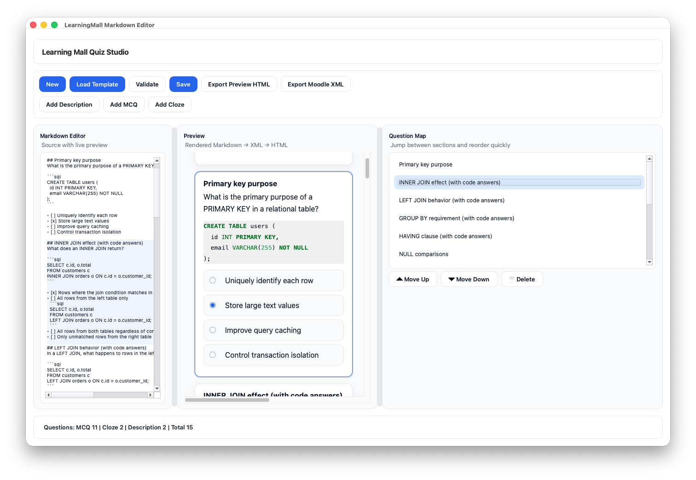

# Learning Mall Tools

Markdown-first utilities for building Moodle quizzes for Learning Mall. Convert a simple Markdown spec into Moodle XML, embed images and syntax-highlighted code, and optionally author quizzes with a small PySide6 editor that includes live preview and quick question reordering.

## Features
- Parse Markdown with optional metadata (`Category`, `Description`, `CodeMode`, `ImageMaxWidth`).
- Support multiple-choice, description-only, and cloze (fill-in-the-blank) questions.
- Render fenced code blocks as inline HTML or PNG images (with optional max width); embed local images as `@@PLUGINFILE@@` attachments.
- Export Moodle-ready XML or a styled HTML preview of the quiz.
- PySide6 GUI with live preview, question map, and templates for new MCQ, cloze, or description blocks.

## Requirements
- Python `>=3.14` (as declared in `pyproject.toml`).
- Dependencies are in `pyproject.toml` (`markdown`, `lxml`, `pygments`, `pillow`, `PySide6` for the GUI).

## Quickstart (uv)
```bash
# Install with uv (preferred)
uv sync

# Convert Markdown -> Moodle XML
uv run md2moodle.py examples/sample-questions.md --output examples/quiz.xml

# Same conversion via Click-based CLI
uv run cli.py convert --md examples/sample-questions.md --output examples/quiz.xml
```

## Markdown format
- Optional metadata lines at the top:
  - `Category: $course$/top/MyCategory`
  - `Description: Intro text shown above questions`
  - `CodeMode: html` (default) or `image` to render fenced code blocks as PNGs
  - `ImageMaxWidth: 600` to cap rendered images (markdown and code blocks)
- Each question starts with `## Question title`.
- Multiple-choice answers use checkboxes: `- [x] Correct` / `- [ ] Incorrect`.
- Description-only blocks: add `Type: Description` under the heading.
- Cloze: add `Type: Cloze` and write blanks as `{{answer}}` or `{{answer1|answer2}}`.

Example:
```markdown
Category: $course$/top/Databases
Description: SQL practice set
CodeMode: html
ImageMaxWidth: 600

## Primary key purpose
What is the primary purpose of a PRIMARY KEY?
- [x] Uniquely identify each row
- [ ] Store large text values

## Fill in the blank
Type: Cloze
Complete the sentence: {{return}} the value.
```

## GUI editor (optional)
Launch the editor with:
```bash
uv run gui.py
```
It provides Markdown editing, a live HTML preview, a question map for navigation/reordering, validation, and quick-insert templates for MCQ/cloze/description blocks.


